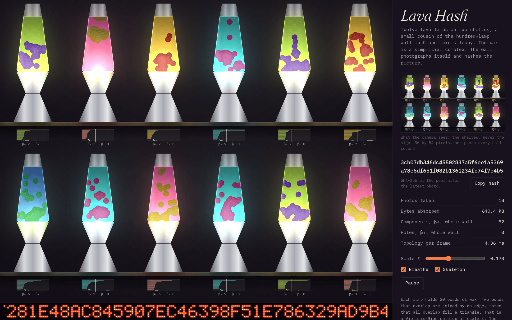
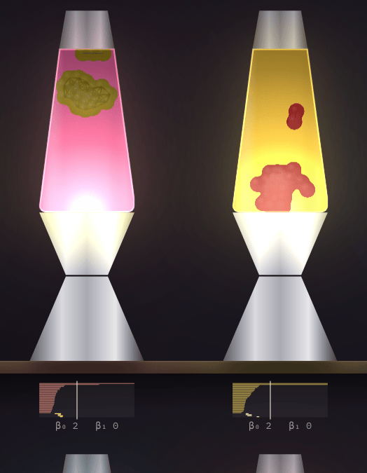

# Lava Hash

Twelve lava lamps on two shelves, a small cousin of the hundred-lamp wall in Cloudflare's lobby. The wax in each lamp is a simplicial complex. Persistent homology draws a barcode under every lamp, a camera photographs the wall every half second, and the photo is stirred into a SHA-256 pool whose output scrolls across an LED sign.

One HTML file, no dependencies, no build step beyond wrapping it in a `<head>`.



## How it works

**The wax.** Each lamp holds 30 beads. The bulb heats beads near the bottom of the glass, everything else cools, the top fastest. Warm wax is buoyant and cool wax sinks. Beads repel when they overlap and pull together when they are close and at a similar temperature, so a warm clump can break off and rise while a cool pool stays behind. Click a lamp to heat it.

**The complex.** Two beads that overlap are joined by an edge, three that all overlap fill a triangle. That is the Vietoris–Rips complex of the bead positions at scale ε. The slider sets ε, and *Breathe* lets it drift slowly so you can watch clumps join and holes open and close. *Skeleton* draws the triangles and the seams between them.

**The barcode.** For every lamp, persistent homology follows each connected component and each hole across all scales up to a fixed extent. The label under a lamp is its barcode: dim bars for components (β₀), bright bars for holes (β₁), with a tick at the current ε. The Betti numbers at ε are printed under the barcode and summed for the whole wall in the panel.



**The camera.** Every half second a 96 by 54 pixel camera photographs the shelves, never the sign. The photo, every lamp's barcode, frame timings and pointer movements are appended to a byte sink. When the photo is taken, the sink and the previous pool state are hashed with SHA-256 to make the new pool state, and a second hash of the pool plus a counter is what gets displayed and scrolled across the sign.

This is a toy, not a CSPRNG. The pool is seeded from `crypto.getRandomValues`, which already makes the output unpredictable on its own; the lamps are decoration around that fact.

## Running it

Open `docs/index.html` in a browser. It works from a plain `file://` URL.

`index.html` at the root is the source: it has no doctype or `<head>` because it started life as a Claude artifact, which supplies those. The build script wraps it:

```
./build.sh          # writes docs/index.html
```

The wax's goo look and the lamps' glow use the canvas `filter` property. Browsers without it still run the page; the wax just draws as plain circles.

## Tests

```
node test/test.js
```

The tests pull the SHA-256 and persistence code out of `index.html` and check them without a browser:

- SHA-256 against Node's implementation, including message lengths at the padding boundaries.
- Betti numbers read off the persistence pairs against a brute-force rank computation over GF(2) on the full complex, for sixty random lamps at six scales each.

## Layout of the source

Everything lives in `index.html`, in this order: SHA-256 and a seeded PRNG, the byte sink, the palettes and lamp silhouette, the `Lamp` class (convection step, persistent homology, barcode serialisation), the drawing code, the LED sign, wall layout, the entropy pool, controls, and the main loop.

The persistence computation is the standard one: union-find over edges sorted by length for dimension 0, then column reduction of the triangle boundary matrix over GF(2) for dimension 1. Anything still apart or still open at the filtration's extent gets an infinite bar.
